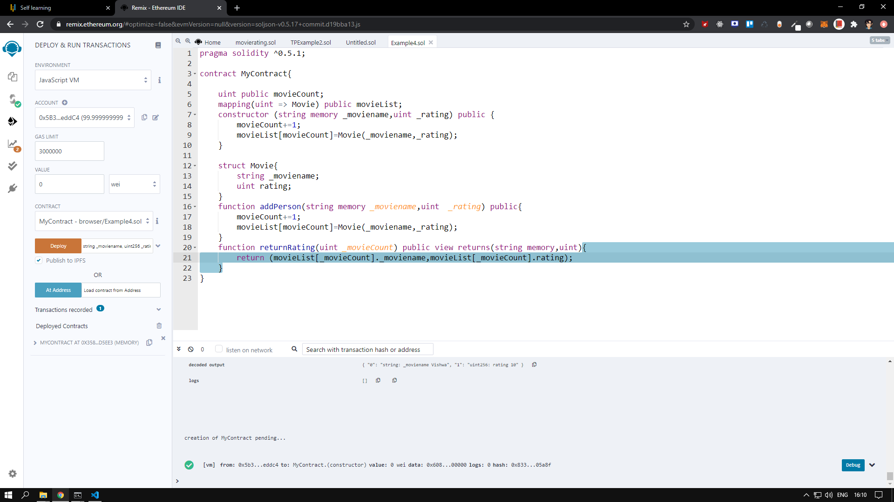
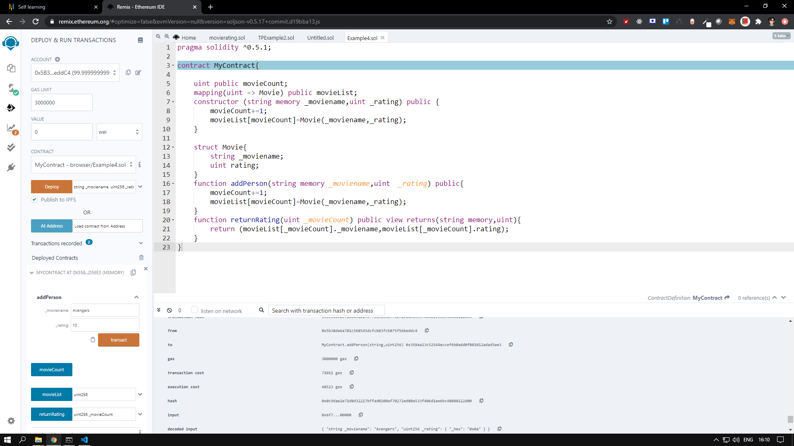
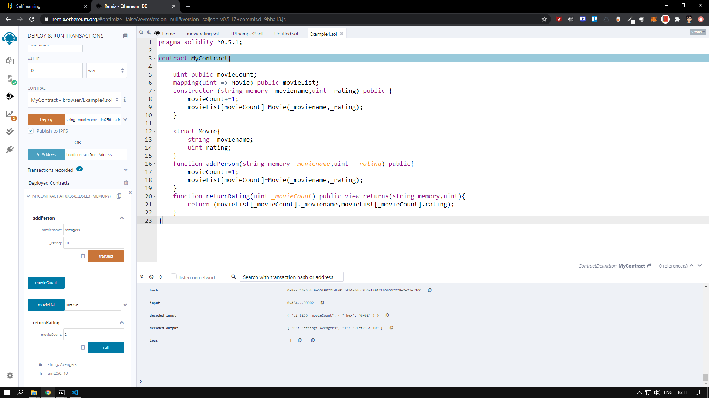
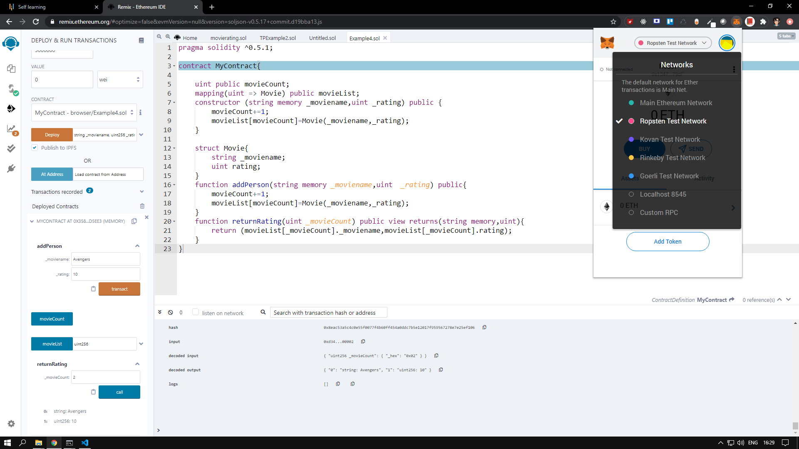

#### Smart Contract for Movie Rating App

```solidity
// SPDX-License-Identifier: MIT
pragma solidity >=0.5.1;

contract MyContract{
    
    uint public movieCount;
    mapping(uint => Movie) public movieList;
    constructor (string memory _moviename,uint _rating) public {
        movieCount+=1;
        movieList[movieCount]=Movie(_moviename,_rating);
    }

    struct Movie{
        string _moviename;
        uint rating;
    }
    function addMovie(string memory _moviename,uint  _rating) public{
        movieCount+=1;
        movieList[movieCount]=Movie(_moviename,_rating);
    }
    function returnRating(uint _movieCount) public view returns(string memory,uint){
        return (movieList[_movieCount]._moviename,movieList[_movieCount].rating);
    }
}
```

* Initially we are creating Structure for moviename and ratings
* movieCount for tracking number of movie in the list
* With Constructor we are creating movie name and rating once it deployed in the network
* addMovie - gets the input for moviename and the rating and add to the mapping
* returnRating() - by passing the movie count value we retrive Name of the Movie and Rating

1. Deployed using Remix or Truffle FrameWork

#### Using Remix IDE








